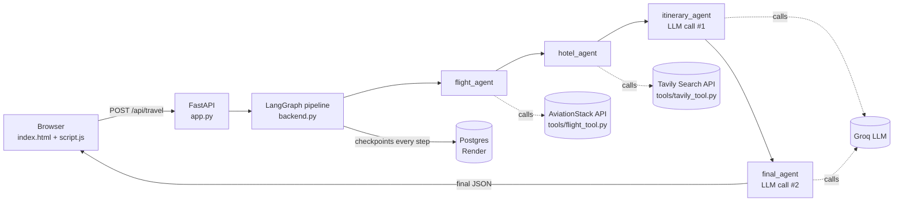

# TripMate AI — Product & Architecture Overview

> **Read this if you want to understand what this repo *does* and *why*, not just what each file contains.**
> Written for a product-manager lens: business purpose first, implementation second.

---

## 1. One-line pitch

TripMate AI turns a single free-text request — *"Plan a complete 7 day Japan trip from Bangladesh under 2 lakhs"* — into a structured, budget-aware travel plan built from **live flight data**, **live web search for hotels/sightseeing**, and an **LLM** that stitches it all into a readable itinerary. It's a multi-agent pipeline (via LangGraph), not a single prompt-and-hope chatbot.

---

## 2. Primary user flow

1. User opens the web app and types a trip request into the textarea (or picks a quick prompt like "Japan Trip").
2. Browser sends `POST /api/travel` with `{ message, thread_id }`.
3. Server resolves the request through four internal stages (see §3) — real flight lookup, real hotel/sightseeing search, a first LLM pass to draft an itinerary, and a second LLM pass to format the final answer.
4. Server responds with JSON containing the final answer (markdown) plus the raw intermediate results (flights, hotels, itinerary) and a `thread_id`.
5. Browser renders the markdown answer, and the user can copy it or download it as a PDF.
6. The `thread_id` is stored in `localStorage`, so a returning user continues the *same* planning session instead of starting cold.

**Why this matters:** the product's core value isn't "an LLM wrote some text" — it's that the LLM's output is grounded in two real, live data sources before it ever generates prose. That's the difference between a travel-sounding hallucination and a usable plan.

---

## 3. Architecture — request lifecycle



Each node in the LangGraph pipeline reads/writes a shared `TravelState` object, and every step is checkpointed to Postgres before moving to the next — so the pipeline's progress is durable, not just in-memory.

---

## 4. File → business purpose map

| File | What it does | Why it exists (business purpose) |
|---|---|---|
| [`app.py`](app.py) | FastAPI server: serves the UI at `/`, exposes `POST /api/travel`, `GET /health` | The **only** way an end user can reach the product. Without it, the agent is a script only a developer can run. |
| [`backend.py`](backend.py) | Defines `TravelState`, the 4-agent LangGraph pipeline, and `run_travel_agent()` | The orchestration brain — decides the *order* of work (flights → hotels → draft → final) and owns conversation memory via Postgres. |
| [`tools/flight_tool.py`](tools/flight_tool.py) | Parses natural language into IATA airport codes, queries AviationStack, formats results | Grounds the plan in **real flight schedules/status** instead of an LLM guessing airline names. Note: status data only, **not ticket prices**. |
| [`tools/tavily_tool.py`](tools/tavily_tool.py) | Runs a live web search via Tavily, returns top 5 summarized results | Grounds hotel/sightseeing suggestions in **current web content** instead of stale training data. |
| [`tools/test.py`](tools/test.py) | Developer scratch script to manually exercise tools/backend | Not part of the product — a debugging aid to sanity-check each tool before trusting the full pipeline. |
| [`templates/index.html`](templates/index.html) | The single-page UI (hero section, prompt input, quick prompts, result panel) | The product's entire front door — a form in, a formatted plan out. |
| [`static/script.js`](static/script.js) | Calls `/api/travel`, renders markdown response, manages `thread_id`, PDF export | Client-side glue connecting the form to the API and making the result shareable/downloadable. |
| [`static/style.css`](static/style.css) | Dark glassmorphism visual theme | Product polish — not core logic. |
| [`requirements.txt`](requirements.txt) | Pinned Python dependencies | Reproducible environment; pins matter because upstream model/API changes (see §8) can silently break the pipeline. |

---

## 5. Data model — `TravelState`

The single object threaded through every stage of the pipeline:

| Field | Set by | Purpose |
|---|---|---|
| `user_query` | Entry point | The raw request, reused by every downstream agent |
| `flight_results` | `flight_agent` | Live flight data, fed into both LLM stages |
| `hotel_results` | `hotel_agent` | Live search results, fed into both LLM stages |
| `itinerary` | `itinerary_agent` | First-draft plan from LLM call #1 |
| `messages` | every node | Running conversation log (LangChain message objects); also what gets checkpointed |
| `llm_calls` | every node | Simple counter — useful for cost/usage tracking per request |

**Why a shared state object instead of passing return values directly:** it's what makes the pipeline resumable and inspectable — any node can be replayed or debugged against the same `TravelState` shape, and the Postgres checkpointer only needs to know about one schema.

---

## 6. Persistence & continuity model

- Every call to `run_travel_agent()` is tied to a `thread_id`.
- `PostgresSaver` (LangGraph's checkpointer) writes state to Postgres **after every node**, not just at the end.
- Same `thread_id` on a later request → LangGraph can resume/continue that conversation rather than starting from zero.
- On first run, `checkpointer.setup()` creates the required tables if they don't exist — **the database starts empty and is populated entirely by usage**, there's no pre-seeded data.

**Product implication:** this is what "session memory" means in this app — a user who returns to the same browser (same `localStorage` thread_id) is continuing a stateful conversation, not starting fresh each time.

---

## 7. External dependencies & their constraints

| Service | Role | Known limitation |
|---|---|---|
| **Groq** (`llama`/`gpt-oss` models via `langchain_groq`) | Powers both LLM stages (draft itinerary + final formatting) | Model availability changes over time — a previously working model ID can 404 without warning (this happened during development; fixed by switching to a currently-available model). Treat the model name as something to periodically verify, not a fixed constant. |
| **AviationStack** | Live flight schedule/status lookup | Provides **status data only, no ticket pricing.** The product explicitly tells the LLM to caveat this to the user. |
| **Tavily** | General web search for hotels/sightseeing | Generic search results, not a curated or bookable hotel inventory — recommendations, not reservations. |
| **Render Postgres** | Conversation/state persistence | External managed DB; connection string currently lives in a plaintext `.env` — a deployment/security item to address before going public (see §8). |

---

## 8. What's *not* built yet (be explicit about this with any PM/stakeholder)

- **No authentication** — anyone hitting the endpoint can use any `thread_id`.
- **No real booking or payment flow** — this is a planning assistant, not a transactional booking product.
- **No fare/price comparison** — flight data is status-only; budget figures in the itinerary come from the LLM's estimate, not a priced source.
- **Secrets hygiene** — API keys and the DB connection string are currently in a plaintext `.env` that was close to being committed; should move to `.env.example` + `.gitignore` before any public repo push or deployment.
- **No automated tests** — `tools/test.py` is a manual scratch script, not a test suite.
- **No deployment config** — currently runs only via local `uvicorn` with `reload=True`; no Docker/production server setup yet.

---

## 9. Cost & latency shape (per user request)

A single `/api/travel` call triggers, **in sequence**:

1. 1 AviationStack API call
2. 1 Tavily API call
3. 2 Groq LLM calls (draft itinerary, then final formatting)
4. Multiple Postgres writes (one checkpoint per pipeline node)

This is a sequential, not parallel, pipeline — each stage waits on the previous one. Worth knowing for both **cost** (2 LLM calls per request) and **latency** (sum of all four external round-trips) when thinking about scaling or UX (e.g. the loading spinner in the UI exists because this can take several seconds).

---

## 10. Running it locally

```powershell
conda activate travel
python app.py
```

Then open `http://127.0.0.1:8000` in a browser. Requires a `.env` file with: `GROQ_API_KEY`, `AVIATIONSTACK_API_KEY`, `TAVILY_API_KEY`, `DATABASE_URL` (Render Postgres).

To test an individual tool or the full pipeline without the browser:

```powershell
python -m tools.test
```
